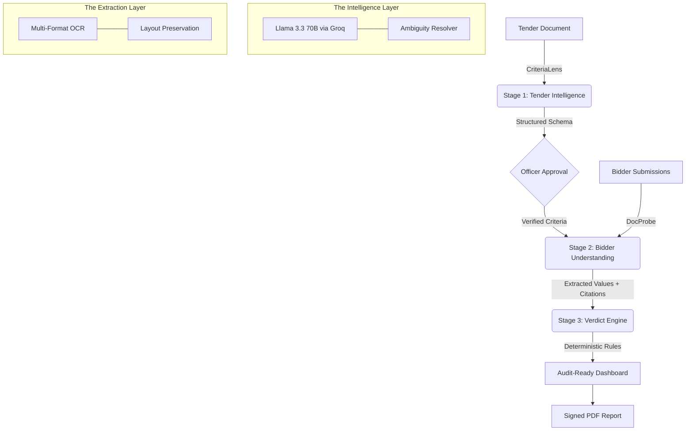

# 🛡️ CriteriaGuard: Governance-Grade AI for Procurement
**Explainable AI Platform for Indian Government Tender Eligibility Evaluation**

[](https://github.com/Saksham-official/CriteriaGuard)
[](https://github.com/Saksham-official/CriteriaGuard)
[](https://github.com/Saksham-official/CriteriaGuard)
[](https://github.com/Saksham-official/CriteriaGuard/pulls)
[](CODE_OF_CONDUCT.md)

CriteriaGuard is a high-integrity, end-to-end platform designed to automate the manual, error-prone process of cross-checking bidder submissions against tender eligibility criteria. Built specifically for the complexities of **Indian Government Procurement**, it ensures every decision is **deterministic, traceable, and fully auditable**.

---

## 🏛️ The Problem: The "Governance Gap"
Every year, procurement committees spend days manually reviewing 100+ page tender documents and diverse bidder submissions (scanned certificates, typed PDFs, photographs). 
- **The Risk**: A single missed condition leads to a wrongful award or a court challenge.
- **The Transparency Gap**: Manual decisions are often untraceable, inviting RTI inquiries.
- **The AI Trap**: Generic AI "black boxes" can hallucinate evidence, which is unacceptable for high-stakes government work.

---

## 🚀 The Solution: CriteriaGuard
CriteriaGuard doesn't replace the procurement officer; it **augments their expertise** with a consistent, evidence-backed first-pass evaluation.

### 🛡️ Core Pillars
1. **Explainable AI (XAI)**: Every "Eligible" or "Not Eligible" verdict is backed by a direct citation (Document Name, Page Number, and Excerpt).
2. **Deterministic Logic**: AI performs the *extraction*, but pure Python code (VerdictCore) performs the *evaluation*. No hallucinations in the final decision.
3. **Tamper-Evident Logs**: SHA-256 chained audit logs ensure that no evaluation result can be quietly altered.
4. **Human-in-the-Loop**: High-ambiguity clauses and borderline numeric values are automatically routed to a human officer for sign-off.

---

## 🏗️ System Architecture (The 3-Stage Pipeline)



---

## 🛠️ Features

### 1. Stage 1 — CriteriaLens (Tender Intelligence)
- Extracts criteria into a formal schema: technical, financial, and compliance.
- **Linguistic Marker Analysis**: Differentiates between mandatory ("shall", "must") and optional ("should", "preferred") clauses.
- **Officer Checkpoint**: Provides a clean checkpoint for the procurement officer to approve the extracted requirements before evaluation begins.

### 2. Stage 2 — DocProbe (Bidder Understanding)
- Multi-format support: Direct PDF extraction, OCR for scanned documents, and Word (.docx) support.
- **Contextual Anchoring**: Locates the exact paragraph and value, recording the source reference.
- **Authenticity Scoring**: Evaluates the quality of the source document to flag low-confidence extractions.

### 3. Stage 3 — VerdictCore (Explainable Verdicts)
- **Zero-Hallucination Engine**: Final verdicts are computed via pure deterministic logic.
- **Borderline Detection**: Automatically flags numeric values within 10% of a threshold (e.g., if turnover is ₹4.9Cr against a ₹5Cr requirement) for human review.
- **Needs Review Queue**: Routes any low-confidence or ambiguous case to a human expert with a plain-English explanation of why the system is unsure.

### 4. Integrity Suite
- **Tamper-Evident Audit Trail**: Append-only log with SHA-256 chaining, suitable for formal record-keeping.
- **Governance Reports**: Generates signed, audit-ready PDF reports with full citation tables for every bidder.

---

## 💻 Technology Stack

- **Backend**: FastAPI (Python 3.11), Pydantic v2 (Schema Validation).
- **CriteriaGuard Frontend**: React 18 (Vite), Glassmorphism UI, High-Performance WebGL (Aurora) animations.
- **LLM Layer**: Llama 3.3 70B (Groq) for high-speed, accurate extraction.
- **OCR Engine**: Tesseract & Cloud Vision Ensemble.
- **Database**: PostgreSQL (Supabase) with SHA-256 Chaining.
- **Deployment**: Containerized (Docker ready) for NIC/MeitY-approved infrastructure.

---

## 🚦 Getting Started

### Prerequisites
- Python 3.11+
- Node.js 18+
- Groq API Key (for Llama 3)
- Supabase Credentials

### Quick Start

1. **Clone the Project**
   ```bash
   git clone https://github.com/Saksham-official/CriteriaGuard.git
   cd CriteriaGuard
   ```

2. **Backend Setup**
   ```bash
   cd backend
   python -m venv venv
   source venv/bin/activate # Windows: .\venv\Scripts\activate
   pip install -r requirements.txt
   # Setup .env with GROQ_API_KEY and SUPABASE_URL/KEY
   python main.py
   ```

3. **CriteriaGuard Frontend Setup**
   ```bash
   cd frontend
   npm install
   npm run dev
   ```

---

## 🤝 Contributing & Community Roadmap
We actively welcome contributions from the open-source and civic-tech community! Whether you are hardening adversarial document defenses, improving NLP criteria parsing, or refining the governance dashboard:

### 🌱 Open Contributor Tracks: Stage 1 — Tender Intelligence (CriteriaLens)

We have opened 3 prioritized tracks for contributors to help advance **CriteriaLens**:

| # | Track / Issue | Focus Area | Labels | Status |
| :-: | :--- | :--- | :--- | :---: |
| **[#2](https://github.com/Saksham-official/CriteriaGuard/issues/2)** | **[Formal Schema Extraction](https://github.com/Saksham-official/CriteriaGuard/issues/2)** | Multi-page RFP chunking, technical/financial/compliance mandates mapping, and Pydantic validation. | `backend`, `criteria-lens`, `enhancement` | **Help Wanted** |
| **[#3](https://github.com/Saksham-official/CriteriaGuard/issues/3)** | **[Linguistic Marker Analysis](https://github.com/Saksham-official/CriteriaGuard/issues/3)** | Deontic modality engine identifying mandatory obligations ("shall", "must") vs optional preferences ("should", "preferred"). | `backend`, `nlp`, `criteria-lens` | **Help Wanted** |
| **[#4](https://github.com/Saksham-official/CriteriaGuard/issues/4)** | **[Approval Checkpoints](https://github.com/Saksham-official/CriteriaGuard/issues/4)** | Interactive procurement officer review interface, edit baseline criteria, and lock SHA-256 audit checkpoint. | `frontend`, `backend`, `governance` | **Help Wanted** |

### 🚀 How to Contribute

1. Browse open issues on our [GitHub Issues Board](https://github.com/Saksham-official/CriteriaGuard/issues).
2. Comment on an issue to let us know you'd like to work on it.
3. Review our [Contributing Guide](CONTRIBUTING.md) for full local setup, linting, and testing workflows.
4. Review our community [Code of Conduct](CODE_OF_CONDUCT.md).
5. Submit a Pull Request referencing the issue (e.g., `Closes #2`). All PRs are automatically verified via [GitHub Actions CI](.github/workflows/ci.yml).

---

## 📜 Governance Commitment
CriteriaGuard is designed to be **domain-agnostic**. Whether it is defense (CRPF), infrastructure, or health, the system adapts to any tender structure. It sits *behind* the existing process, making it faster, more consistent, and 100% traceable.

---

*“Built for the realities of Indian Government Procurement—where accountability meets intelligence.”* 🛡️
